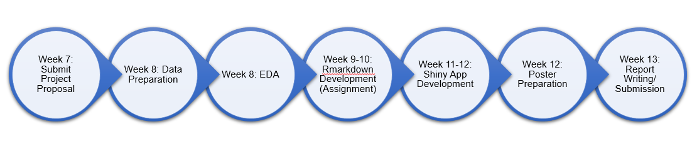

```{r setup, include=FALSE}
knitr::opts_chunk$set(echo = FALSE)
```

# Motivation of the project

With the outbreak of Covid-19 and recent advancements in vaccination, an important task that public health authorities are looking into is increasing vaccination rates. This would entail looking into the factors that result in an individual undergoing vaccination and how to predict whether an individual would go for the vaccine. 

Our team is interested in drawing a parallel to another 21st century pandemic, the H1N1 virus, which is also known as the swine flu, that broke out in 2009. An extensive study had been conducted by the USA known as the **National 2009 H1N1 Flu Survey (NHFS)** into the demographics, attitudes towards H1N1 virus or the vaccine, and whether an individual had taken the H1N1 vaccine. This extensive dataset would not just allow us to perform descriptive analytics on how H1N1 vaccination rates vary in USA, but also allows us to do predictions on whether an individual would go for the vaccine. 

# Data Source

The source for our data is provided at the following link: 
https://www.cdc.gov/nchs/nis/data_files_h1n1.htm

# Problems or issues that the project will address
This project will address the following problems: 

- Descriptive Analytics: How do vaccination rates vary across states in the USA? 
- Predictive Analytics: How do we predict whether an individual would go for the H1N1 vaccine? 

# Project Objectives
The project aims to use NFHS data to:

- Visualize vaccination receptivity in across states in US
- Visualize the relationships between vaccination and other variables.
- Create predictive model of vaccination through Logistic regression, Decision tree and random forest

# Proposed Scope and Methodology (Approach that we plan to take to solve the problem)

## Data Preparation 

Data cleaning will be done using Excel and R. Excel is used as the first preliminary data cleaning to remove columns that will not be used and to combine binary columns into a single column. As for R, we will be using it to remove rows that have blanks for our target variables and to remove columns that have a proportion of blanks above a certain percentage. 

## Visualization

The first page of the visualization would be our Map. In the Map, we would show how the survey responses and vaccination rates differ across various states in the USA. 

The second page of the visualization would be our Exploratory Data Analysis (EDA). In our EDA, we will explore the factors that affect H1N1 vaccination. We will have visualizations for both a density plot and a multiplot. The density plot will help users visualize how every factor affects whether an individual would go for vaccination. Users can select the factors to be displayed on the correlation plot. The multiplot will help us to visualize the distribution of our target binary variable according to the factors in the survey. Users can select the factor that they wish to display on the visualization. 

The third page of the visualization is our logistic regression. The fourth page is our decision tree. 

The last page of the visualization is our Model Comparison. 

# Early prototypes or storyboards 

Page 1: Map 

```{r, out.width='80%', fig.align='left'}
knitr::include_graphics('picture/1.jpg')
```

Page 2: Exploratory Data Analysis (EDA) - Density Plot & Multiplot 

```{r, out.width='60%', fig.align='left'}
knitr::include_graphics('picture/2.jpg')
```

Page 3: Predictive Analytics

```{r, out.width='60%', fig.align='left'}
knitr::include_graphics('picture/3.jpg')
```

Page 4: Decision Tree

Page 5: Model Comparison 


# R Packages to be used

Package Name  | Description
------------- | -------------
Shiny and shinydashboard    | For building interactive web applications with R
dplyr       | For effective data manipulation
readr       | For reading excel files in R
ggplot2     | For plotting various visualizations and EDA
dlookr      | For plotting various visualizations and EDA
rpart       | To perform recursive partitioning I.e. Decision Tree modelling
randomForest| To perform random forest modelling

# Project Timeline
```{r, out.width='200%', fig.align='center'}

```

# References
Comparison of the Logistic Regression, Decision Tree, and Random Forest Models to Predict Red Wine Quality in R: https://towardsdatascience.com/comparison-of-the-logistic-regression-decision-tree-and-random-forest-models-to-predict-red-wine-313d012d6953

A COMPLETE GUIDE TO RANDOM FOREST IN R: https://www.listendata.com/2014/11/random-forest-with-r.html

Introduction to Random Forest in R: https://www.simplilearn.com/tutorials/data-science-tutorial/random-forest-in-r

Logistic Regression in R: A Classification Technique to Predict Credit Card Default: https://blog.datasciencedojo.com/logistic-regression-in-r-tutorial/
