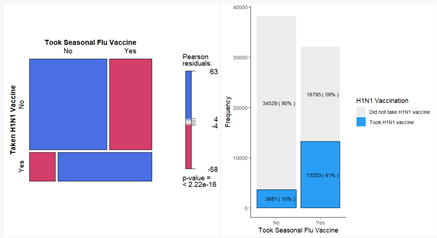

```{r setup, include=FALSE}
knitr::opts_chunk$set(echo = FALSE)
```

# Vaccination Survey Analysis and Prediction 

# Motivation of the project

With the outbreak of Covid-19 and recent advancements in vaccination, an important task that public health authorities are looking into is increasing vaccination rates. This would entail looking into the factors that result in an individual undergoing vaccination and how to predict whether an individual would go for the vaccine. 

Our team is interested in research the increase vaccination rates and reduce vaccination hesitancy would entail looking into the factors that result in an individual undergoing vaccination. The project was motivated by a desire to firstly understand what the factors influencing an individual to go for vaccination and how assist authorities to improve vaccination rates. 

An extensive study had been conducted by the USA known as the **National 2009 H1N1 Flu Survey (NHFS)** into the demographics, attitudes towards H1N1 virus or the vaccine, and whether an individual had taken the H1N1 vaccine. This extensive dataset would not just allow us to perform descriptive analytics on how H1N1 vaccination rates vary in USA, but also allows us to do predictions on whether an individual would go for the vaccine. 

# Data Source

The source for our data is provided at the following link: 
https://www.cdc.gov/nchs/nis/data_files_h1n1.htm

# Problems or issues that the project will address
This project will address the following problems: 

- Descriptive Analytics: How do vaccination rates vary across states in the USA? 
- Predictive Analytics: How do we predict whether an individual would go for the H1N1 vaccine? 

# Project Objectives
The project aims to use NFHS data to:

- Visualize vaccination receptivity in across states in US
- Visualize the relationships between vaccination and other variables.
- Create predictive model of vaccination through Logistic regression, Decision tree and random forest

# Proposed Scope and Methodology

## Data Preparation 

Data cleaning will be done using Excel and R. Excel is used as the first preliminary data cleaning to remove columns that will not be used and to combine binary columns into a single column. As for R, we will be using it to remove rows that have blanks for our target variables and to remove columns that have a proportion of blanks above a certain percentage. 

## Visualization

The first page of the visualization would be our Map. In the Map, we would show how the survey responses and vaccination rates differ across various states in the USA. 

The second page of the visualization would be our Exploratory Data Analysis (EDA). In our EDA, we will explore the factors that affect H1N1 vaccination. We will have visualizations for both a density plot and a multiplot. The density plot will help users visualize how every factor affects whether an individual would go for vaccination. Users can select the factors to be displayed on the correlation plot. The multiplot will help us to visualize the distribution of our target binary variable according to the factors in the survey. Users can select the factor that they wish to display on the visualization. 

The third page of the visualization is our logistic regression. The fourth page will showcase the decision tree and random forest model. 

The last page of the visualization is our Model Comparison. 

# Early prototypes or storyboards 

Page 1: Map 

```{r, out.width='80%', fig.align='left'}
knitr::include_graphics('picture/1.jpg')
```

Page 2: Exploratory Data Analysis (EDA) - Density Plot & Multiplot 

```{r, out.width='60%', fig.align='left'}
knitr::include_graphics('picture/2.jpg')
```

Stacked Bar Chart and Mosaic Plot

Bar charts visualize the distribution of variables and is suit- able for categorical variables (as compared to a histogram that is suitable for continuous variables). By using a stacked bar chart, the chart can be used to differentiate values in the dataset along another parameter.

Mosaic plots are used to visualize categorical data and can be used to visualize the numbers from a contingency table. For this project, mosaic plots are plotted to visualize the relationship between key behavioural and risk factors with the binary target variabl


```{r, out.width='60%', fig.align='left'}

```


Page 3: Explanatory Model

Bar chart

a bar chart is selected to vi- sualize how the probabilities of vaccination vary according to different categories under each variable in the explana- tory model. From example, we found that H1N1 vaccina- tion probability is 119% higher for respondents with con- cern level1 (not very concerned about H1N1), compared to respondents with concern level0 (not at all concerned about H1N1).

Dot Chart with Error bar

A dot chart is selected to plot the odds ratio in a single plot as it is an appropriate and precise way to present the data visualization. Standard deviation and standard error are the characteristic of the population.

Page 4: Predictive Model and Model Comparison

```{r, out.width='60%', fig.align='left'}
knitr::include_graphics('picture/3.jpg')
```

# R Packages to be used

Package Name  | Description
------------- | -------------
Shiny and shinydashboard    | For building interactive web applications with R
dplyr       | For effective data manipulation
readr       | For reading excel files in R
ggplot2     | For plotting various visualizations and EDA
dlookr      | For plotting various visualizations and EDA
rpart       | To perform recursive partitioning I.e. Decision Tree modelling
randomForest| To perform random forest modelling

# Project Timeline
```{r, out.width='200%', fig.align='center'}

```

# References
Comparison of the Logistic Regression, Decision Tree, and Random Forest Models to Predict Red Wine Quality in R: <span style= "color:blue">https://towardsdatascience.com/comparison-of-the-logistic-regression-decision-tree-and-random-forest-models-to-predict-red-wine-313d012d6953</span>

A COMPLETE GUIDE TO RANDOM FOREST IN R: <span style= "color:blue">https://www.listendata.com/2014/11/random-forest-with-r.html</span>

Introduction to Random Forest in R: <span style= "color:blue">https://www.simplilearn.com/tutorials/data-science-tutorial/random-forest-in-r</span>

Logistic Regression in R: A Classification Technique to Predict Credit Card Default: <span style= "color:blue">https://blog.datasciencedojo.com/logistic-regression-in-r-tutorial/</span>
