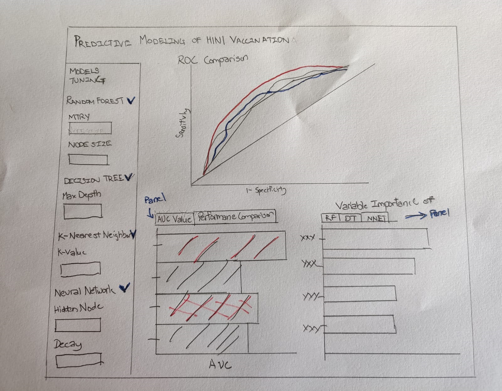

```{r setup, include=FALSE}
knitr::opts_chunk$set(echo = TRUE,
                      message = FALSE,
                      warning = FALSE)
```

# 1. Introduction

With the ongoing COVID-19 pandemic, the world is experiencing first-hand on how a virus could affect economy, society and the deaths that it could cause. The importance of having a vaccine and having the general population taking the vaccine is key to curbing the spread of the virus and saving lives.  

A similar situation was the H1N1 virus pandemic which occurred in 2009, where an estimated amount of 151,700-575,400 people worldwide had died during the first year of the virus. Being able to predict which individuals are likely to receive their H1N1 vaccinations, it will guide governments, health officials to know what are the important predictors that lead them to take the H1N1 vaccine. This understanding would be useful in future efforts to promote vaccination to the public, especially when a vaccine for the current pandemic is made.  


## 1.1 Purpose

The purpose of the study is to develop various predictive models on the individuals who are likely to take the H1N1 vaccine based on the flu survey data , to be able to assess the models for the optimal model and visualize the assessment. 

# 2. Data Preparation

The data used was obtained from the United States Centre of Disease Control and Prevention (CDC)'s website *https://www.cdc.gov/nchs/nis/data_files_h1n1.htm* on the National 2009 H1N1 flu survey conducted in the US. 

## 2.1 Data Source

The dataset in excel format was imported by *read_csv* into the RStudio environment. 
The following code was used to launch the mentioned packages in R. 

```{r}
#R packages used to modelling and visualization

packages = c('tidyverse','readr','caret','caTools','ggpubr','ROCR','pROC','plotROC','plotly')
for (p in packages){
  if(!require(p, character.only = T)){
  install.packages(p)
  }
  library(p,character.only= T ) 
} 

```

```{r, results='hide'}
H1N1 <- read_csv('data/H1N1_Final_dan_edit.csv')

glimpse(H1N1)
```

Check for missing data i.e NA is conducted on the data. Variables with missing data were noted down. 

```{r}
colMeans(is.na(H1N1))
```

## 2.2 Date Wrangling and Cleaning

Before the dataset can be used for modelling, the missing data would need to processed. 

The following section focused on wrangling the data set and cleaning up missing variables. 
The code below is used to remove the missing data from the target variable, *VACC_H1N1_F*.

```{r}
#exclude the NA column in the target variable
H1N1 <- H1N1 %>%
  filter(!is.na(VACC_H1N1_F))
```

```{r}
names(H1N1)[names(H1N1) == 'CONCERN LEVEL'] <- "CONCERN_LEVEL" #Renaming of variable "Concern Level"
```

```{r}
H1N1[H1N1 == '#N/A'] <- NA # Changing all the value with "#N/A" to actual missing value.
```

```{r}
colMeans(is.na(H1N1)) #Check for missing values again.
```

Data will more than 50% of missing values are removed. 27 variables are wrangled into a new data set *h1n1data*.

```{r}
h1n1data <-H1N1 %>%
  select(VACC_H1N1_F,
                   VACC_SEAS_F,
                   B_H1N1_ANTIV,
                   B_H1N1_AVOID,
                   B_H1N1_FMASK,
                   B_H1N1_HANDS,
                   B_H1N1_LARGE,
                   B_H1N1_RCONT,
                   B_H1N1_TOUCH,
                   CONCERN_LEVEL,
                   INT_H1N1,
                   KNOW_H1N1,
                   INT_SEAS,  
                   DOCREC,
                   CHRONIC_MED_F,
                   CLOSE_UNDER6MO_F,         
                   HEALTH_WORKER_F,
                   PATIENT_CONTACT_F,
                   AGEGRP,
                   EDUCATION_COMP,
                   HH_CHILD_R,
                   INC_CAT1,
                   MARITAL,
                   RACEETH4_I,
                   N_ADULT_R,
                   SEX_I,
                   STATE)
```

The column variables are transformed in factor(categorical) variables. 

```{r}
h1n1data <- transform(h1n1data,
                   VACC_H1N1_F= as.factor(VACC_H1N1_F),
                   VACC_SEAS_F= as.factor(VACC_SEAS_F),
                   B_H1N1_ANTIV= as.factor(B_H1N1_ANTIV),
                   B_H1N1_AVOID= as.factor(B_H1N1_AVOID),
                   B_H1N1_FMASK= as.factor(B_H1N1_FMASK),
                   B_H1N1_HANDS= as.factor(B_H1N1_HANDS),
                   B_H1N1_LARGE= as.factor(B_H1N1_LARGE),
                   B_H1N1_RCONT= as.factor(B_H1N1_RCONT),
                   B_H1N1_TOUCH= as.factor(B_H1N1_TOUCH),
                   CONCERN_LEVEL= as.factor(CONCERN_LEVEL),
                   INT_H1N1= as.factor(INT_H1N1),
                   KNOW_H1N1= as.factor(KNOW_H1N1),
                   DOCREC= as.factor(DOCREC),
                   CHRONIC_MED_F= as.factor(CHRONIC_MED_F),
                   CLOSE_UNDER6MO_F= as.factor(CLOSE_UNDER6MO_F),
                   HEALTH_WORKER_F= as.factor(HEALTH_WORKER_F),
                   AGEGRP= as.factor(AGEGRP),
                   EDUCATION_COMP= as.factor(EDUCATION_COMP),
                   HH_CHILD_R= as.factor(HH_CHILD_R),
                   INC_CAT1= as.factor(INC_CAT1),
                   MARITAL= as.factor(MARITAL),
                   RACEETH4_I= as.factor(RACEETH4_I),
                   N_ADULT_R= as.factor(N_ADULT_R),
                   SEX_I= as.factor(SEX_I),
                   STATE= as.factor(STATE),
                   PATIENT_CONTACT_F = as.factor(PATIENT_CONTACT_F),
                   INT_SEAS = as.factor(INT_SEAS)
                   )
```

The code below added a column which recoded the various states into regions.

```{r}
region <- read_csv("data/state_region.csv")

```

```{r}
h1n1data$state_recoded <- str_to_title(h1n1data$STATE)
h1n1data <- left_join(h1n1data, region,
                      by=c("state_recoded" = "State"))
```

```{r}
summary(h1n1data)
```

The predictors are plotted against the target variable to check for complete or quasi-complete separation.

```{r panelset,echo=FALSE}
xaringanExtra::use_panelset()
```

::::: {.panelset}

::: {.panel}
[Plots I]{.panel-name}
```{r,echo=FALSE}

  p1<- h1n1data %>% 
  #drop_na(VACC_SEAS_F) %>%
  ggplot(aes(x = VACC_SEAS_F, fill = VACC_H1N1_F)) +
  geom_bar()
 
  p2<- h1n1data %>% 
  #drop_na(B_H1N1_ANTIV) %>%
  ggplot(aes(x = B_H1N1_ANTIV, fill = VACC_H1N1_F)) +
  geom_bar()

  p3<- h1n1data %>% 
  #drop_na(B_H1N1_AVOID) %>%
  ggplot(aes(x = B_H1N1_AVOID, fill = VACC_H1N1_F)) +
  geom_bar()
  
  p4<- h1n1data %>% 
  #drop_na(B_H1N1_FMASK) %>%
  ggplot(aes(x = B_H1N1_FMASK, fill = VACC_H1N1_F)) +
  geom_bar()
  
  p5<- h1n1data %>% 
  #drop_na(B_H1N1_HANDS) %>%
  ggplot(aes(x = B_H1N1_HANDS, fill = VACC_H1N1_F)) +
  geom_bar()

  
  p6<- h1n1data %>% 
  #drop_na(B_H1N1_LARGE) %>%
  ggplot(aes(x = B_H1N1_LARGE, fill = VACC_H1N1_F)) +
  geom_bar()
  
  p7<- h1n1data %>% 
  #drop_na(B_H1N1_RCONT) %>%
  ggplot(aes(x = B_H1N1_RCONT, fill = VACC_H1N1_F)) +
  geom_bar()
  
  p8<- h1n1data %>% 
  #drop_na(B_H1N1_TOUCH) %>%
  ggplot(aes(x = B_H1N1_TOUCH, fill = VACC_H1N1_F)) +
  geom_bar()
  
  p9<- h1n1data %>% 
  #drop_na(CONCERN_LEVEL) %>%
  ggplot(aes(x = CONCERN_LEVEL, fill = VACC_H1N1_F)) +
  geom_bar()
  
  p10<- h1n1data %>% 
  #drop_na(INT_H1N1) %>%
  ggplot(aes(x = INT_H1N1, fill = VACC_H1N1_F)) +
  geom_bar()
  
  p11<- h1n1data %>% 
  #drop_na(KNOW_H1N1) %>%
  ggplot(aes(x = KNOW_H1N1, fill = VACC_H1N1_F)) +
  geom_bar()
  
  p12<- h1n1data %>% 
  #drop_na(INT_SEAS) %>%
  ggplot(aes(x = INT_SEAS, fill = VACC_H1N1_F)) +
  geom_bar()
  
  ggarrange(p1,p2,p3,p4,p5,p6,p7,p8,p9,p10,p11,p12, ncol=4, nrow=3, common.legend = TRUE, legend="bottom")
```
:::

:::{.panel}
[Plots II]{.panel-name}  
```{r, echo=FALSE}

  p13<- h1n1data %>% 
  #drop_na(DOCREC) %>%
  ggplot(aes(x = DOCREC, fill = VACC_H1N1_F)) +
  geom_bar()
 
  p14<- h1n1data %>% 
  #drop_na(CHRONIC_MED_F) %>%
  ggplot(aes(x = CHRONIC_MED_F, fill = VACC_H1N1_F)) +
  geom_bar()

  p15<- h1n1data %>% 
  #drop_na(CLOSE_UNDER6MO_F) %>%
  ggplot(aes(x = CLOSE_UNDER6MO_F, fill = VACC_H1N1_F)) +
  geom_bar()
  
  p16<- h1n1data %>% 
  #drop_na(HEALTH_WORKER_F) %>%
  ggplot(aes(x = HEALTH_WORKER_F, fill = VACC_H1N1_F)) +
  geom_bar()
  
  p17<- h1n1data %>% 
  #drop_na(PATIENT_CONTACT_F) %>%
  ggplot(aes(x = PATIENT_CONTACT_F, fill = VACC_H1N1_F)) +
  geom_bar()

  
  p18<- h1n1data %>% 
  #drop_na(HH_CHILD_R) %>%
  ggplot(aes(x = HH_CHILD_R, fill = VACC_H1N1_F)) +
  geom_bar()
  
  
  p19<- h1n1data %>% #to remove from variables as got quasi complete seperation
  #drop_na(INT_H1N1) %>%
  ggplot(aes(x = INC_CAT1, fill = VACC_H1N1_F)) +
  geom_bar()
  
  p20<- h1n1data %>% 
  #drop_na(MARITAL) %>%
  ggplot(aes(x = MARITAL, fill = VACC_H1N1_F)) +
  geom_bar()
  
  
  p21<- h1n1data %>% 
  #drop_na(N_ADULT_R) %>%
  ggplot(aes(x = N_ADULT_R, fill = VACC_H1N1_F)) +
  geom_bar()
  
  p22<- h1n1data %>% 
  #drop_na(SEX_I) %>%
  ggplot(aes(x = SEX_I, fill = VACC_H1N1_F)) +
  geom_bar()
  

  
  
  ggarrange(p13,p14,p15,p16,p17,p18,p19,p20,p21,p22, ncol=3, nrow=4, common.legend = TRUE, legend="bottom")
```
:::

::: {.panel}
[Plots III]{.panel-name}
```{r, echo=FALSE}

  p23<- h1n1data %>% 
  #drop_na(AGEGRP) %>%
  ggplot(aes(x = AGEGRP, fill = VACC_H1N1_F)) +
  geom_bar()+
  theme(axis.text.x = element_text(size = 3))
  
  p24<- h1n1data %>% 
  #drop_na(EDUCATION_COMP) %>%
  ggplot(aes(x = EDUCATION_COMP, fill = VACC_H1N1_F)) +
  geom_bar()+
  theme(axis.text.x = element_text(size = 3))
  
  
  p25<- h1n1data %>% 
  #drop_na(INC_CAT1) %>%
  ggplot(aes(x = INC_CAT1, fill = VACC_H1N1_F)) +
  geom_bar()+
  theme(axis.text.x = element_text(size = 3))
  
  
  p26<- h1n1data %>% 
  #drop_na(RACEETH4_I) %>%
  ggplot(aes(x = RACEETH4_I, fill = VACC_H1N1_F)) +
  geom_bar()+
  theme(axis.text.x = element_text(size = 3))

  
  p27<- h1n1data %>% 
  #drop_na(STATE) %>%
  ggplot(aes(x = STATE, fill = VACC_H1N1_F)) +
  geom_bar()+
  theme(axis.text.x = element_blank())
  
  
  ggarrange(p23,p24,p25,p26,p27, ncol=2, nrow=3, common.legend = TRUE, legend="bottom")
  
```
:::

:::::


The new dataframe *h1n1model* is created. 3 variables with complete/quasi-complete separation were removed.

```{r}

h1n1model <- h1n1data #new dataframe for predictive modeling
              

h1n1model <-select(h1n1model,-c(INT_H1N1,B_H1N1_ANTIV,INT_SEAS, state_recoded, Region)) #Remove variable with complete separation from dataset.


h1n1model <- h1n1model %>% #Omitting na in order as some models unable to process with missing values. 
             na.omit

summary(h1n1model) #To check the data again.
```

# 3 Modeling

## 3.1 Literature Review: Choosing the right Modeling Package

The R *caret* package is a set of functions that streamlines the process for predictive model building. It's current release consist 238 models.As different modeling functions has different syntax for modeling training and prediction, it will be difficult to keep track of which algorithms are in which package. For example, a random forest model will be using *randomforest()* syntax to run the model and a neural network model requires the *neuralnet()* syntax. Moreover, each of the algorithm will have their own arguments, making it difficult and time-consuming if different models are required to be used in the same code. 

There is no need to call for the library for the different modeling packages using *caret*. *caret* will assist to load the required packages when used and if the package is missing, there will be a prompt for installation. 

The *train()* function in *caret* has multiple functions: 

1. Building a model using a specific algorithm
2. Cross validating the model
3. Tune the parameters for optimal model performance
4. Choose the optimal model based on a given evaluation metric
5. Preprocessing

The *caret* package made it easier by combining the data pre-processing, model hyperparameter tuning within the same package. It allows quick change of model with minor syntax change, allowing it the most suitable model to be found. 

## 3.2 Data Splitting

As the H1N1 vaccination (*VACC_H1N1_F*) is the target variable is important for analysis, a balance of the target variable across the training/test sets, the function *createDataPartition* was used to create training/testing sets using stratified random sampling.

Data is split with 80% as training data and 20% are testing data.In place of partitioning a validation dataset, the *traincontrol* function is used for the cross-validation of the training data set. 

The below code shows the spliting of the dataset. 

```{r}
set.seed(123)

# define an 80%/20% train/test split of the h1n1model data set
split=0.80 
trainIndex <- createDataPartition(h1n1model$VACC_H1N1_F, p=split, list=FALSE)
data_train <- h1n1model[ trainIndex,]
data_test <- h1n1model[-trainIndex,]

```

## 3.3 Model Tuning

The function *trainControl* generates parameters that further control how models are created, with different resampling methods like bootstrap re-sampling, k-fold cross validation. In the code below, the k-fold cross validation method with *number =* referring to the number of folds being used. 
The repeated k-fold cross validation method involves splitting the dataset into k-subsets and repeating in a number of time. For each subset is held out while the model is trained on all other subsets. This process is completed until accuracy is determine for each instance in the dataset, and an overall accuracy estimate is provided.

```{r}

fitControl <- trainControl(
  method = "cv",
  number = 5,
  classProbs = TRUE,
  summaryFunction = twoClassSummary, #twoClassSummary computes the sensitivity, specificity and aread under the ROC curve. 
  savePredictions = TRUE)

```

There are two main ways of tuning the model within the *caret* package, using *tuneLength* or *tuneGrid*.

The *tuneLength* parameter allows the user to enter a value which will determine the number of default values being used as the main parameter for a specific model. The number used can be applicable throughout all the models. The *tuneGrid* function create a dataframe to store the tuning parameter grid specified by the user. It allows the user to determine which are the values a model will take as it's main parameter. The parameters in the *tuneGrid* is model specific. Using *tuneGrid* will be more applicable as it provides the user more model customizability and fine tuning.  

For random forest using the *ranger* method in caret, three options are available for tuning the model. Firstly, *mtry* which refers to the number of variables randomly sampled as candidates at each split. Split rule defines which splitting method is used. The default used is *Gini* where the split minimizes the the Gini impurtity for classification.  The minimum node size refers to the minimum number of observations in a terminal node. 

According the research (Probst et al.,2019), *mtry* has the most influence over the model performance and the best value of mtry depends on the number of variables that are related to the outcome.

```{r}
# Random Forest:
set.seed(123)

m=4
ns=10

rf_grid <- expand.grid(
                mtry = 2:m,
                splitrule ="gini",
                min.node.size = 10
                      )

model_rf <- train(VACC_H1N1_F~., 
                  data=data_train, 
                  trControl = fitControl, 
                  method = "ranger",
                  metric = "ROC",
                  importance = "impurity",
                  tuneGrid = rf_grid)

model_rf
```


The *rpart2* method within the *caret* package allows for the tuning for the maximum depth of the tree. This tuning variable can help to limit the decsion tree model from growing too deep which might cause over-fitting. 


```{r}
#Decision Tree
set.seed(123)

depth = 5 #User-defined maximum depth of decision tree

dt_grid<- expand.grid(maxdepth = depth)

model_dt <- train(VACC_H1N1_F~., 
                  data=data_train, 
                  trControl = fitControl, 
                  method = "rpart2",
                  metric = "ROC",
                  tuneGrid = dt_grid
                  )

model_dt
```

The principle behind K-Nearest Neighbor(KNN) algorithm is to find K predefined number of training samples that are closest in the distance to a new point & predict a label for our new point using these samples. For classification the KNN method starts by identifying the k most similar training observations (i.e. neighbors) to the new observation, and then assigns the observation to the class containing the majority of its neighbors.

The choice of k considerably impacts the output of KNN model. *k = 1* corresponds to a highly flexible method resulting to a training error rate of 0 (over-fitting), but the test error rate may be quite high. The value of optimal k is usually the square root of N, where N is the total number of samples. 


```{r}

#K-Nearest Neighbors
set.seed(123)

kv=10  #User-defined k value

knn_grid <- expand.grid(k= kv)

model_knn <- train(VACC_H1N1_F~., 
                  data=data_train, 
                  trControl = fitControl, 
                  method = "knn",
                  metric = "ROC",
                  tuneGrid = knn_grid
                  )

model_knn
```


For the neural network(nnet) model,there are two tuning parameters, which need to be set. First is the number of nodes in the hidden layer and second, it is the value of the “weight decay” parameter. 

The hidden layer of the neural network is the intermediate layer between the input and output layer of a neuron network (Panchal & Panchal, 2014, p. 460). The hidden nodes might cause overfitting when too many neurons(hidden nodes) are present in the network. The purpose of the weight decay factor is to prevent overfitting. 

```{r}

#Neural Network  
set.seed(123)

sz = 1 #User-defined number of hidden nodes
dc = 0 #USer-defined decay rate

nnet_grid <- expand.grid( size = sz,
                          decay = dc)


model_nnet <- train(VACC_H1N1_F~., 
                  data=data_train, 
                  trControl = fitControl, 
                  method = "nnet",
                  metric = "ROC",
                  tuneGrid = nnet_grid
                  )

model_nnet
```

# 4. Plotting Variable Importance

Variable importance helps to identify most important variables that contribute most significantly to the target variable.Being able to select the most important predictor variables that explains the major part of variance of a target variable can help to identify and build high performing models.

The variable importance of each trained model is plotted.(*Note:kNN does not have variable importance*)

::::: {.panelset}

::: {.panel}
[Variable Importance of Random Forest]{.panel-name}

```{r}

rfImp <- varImp(model_rf)
dtImp <- varImp(model_dt)
nnetImp <- varImp(model_nnet)

No_Var=5 #No.of variable importance to be shown can be user-defined.

g1 <- rfImp$importance %>% 
  as.data.frame() %>%
  rownames_to_column() %>%
  arrange(Overall) %>%
  mutate(rowname = forcats::fct_inorder(rowname )) %>%
  top_n(No_Var,Overall) %>%  #top 5 Importance
  ggplot(aes(x = rowname, y = Overall))+
    geom_col(color="black",fill = "light blue")+
    coord_flip()+
    xlab("Variable")+
    ggtitle("Variable Importance of Random Forest Model") + 
    theme_minimal() +
    theme(panel.background = element_rect(fill = "gray80", color = "gray80", size =0.5, linetype = "solid"),
       panel.grid.major = element_line(size =0.5, linetype = "solid", color = "white"), #major refers to grid line at values
       panel.grid.minor = element_line(size =0.25, linetype = "solid", color = "white")) # minor refers line in between grid values

ggplotly(g1, tooltip = c("rowname", "Overall"))

```
:::

::: {.panel}
[Variable Importance of Decision Tree]{.panel-name}

```{r}

g2 <- dtImp$importance %>% 
  as.data.frame() %>%
  rownames_to_column() %>%
  arrange(Overall) %>%
  mutate(rowname = forcats::fct_inorder(rowname )) %>%
  top_n(No_Var,Overall) %>%  #top 5 Importance
  ggplot(aes(x = rowname, y = Overall))+
    geom_col(color="black",fill = "light blue")+
    coord_flip()+
    xlab("Variable")+
    ggtitle("Variable Importance of Decision Tree Model") + 
    theme_minimal() +
    theme(panel.background = element_rect(fill = "gray80", color = "gray80", size =0.5, linetype = "solid"),
       panel.grid.major = element_line(size =0.5, linetype = "solid", color = "white"), #major refers to grid line at values
       panel.grid.minor = element_line(size =0.25, linetype = "solid", color = "white")) # minor refers line in between grid values

ggplotly(g2, tooltip = c("rowname", "Overall"))

```
:::

::: {.panel}
[Variable Importance of Neural Network]{.panel-name}

```{r}

g3 <- nnetImp$importance %>% 
  as.data.frame() %>%
  rownames_to_column() %>%
  arrange(Overall) %>%
  mutate(rowname = forcats::fct_inorder(rowname )) %>%
  top_n(No_Var,Overall) %>%  #top 5 Importance
  ggplot(aes(x = rowname, y = Overall))+
    geom_col(color="black",fill = "light blue")+
    coord_flip()+
    xlab("Variable")+
    ggtitle("Variable Importance of Neural Network Model") + 
    theme_minimal() +
    theme(panel.background = element_rect(fill = "gray80", color = "gray80", size =0.5, linetype = "solid"),
       panel.grid.major = element_line(size =0.5, linetype = "solid", color = "white"), #major refers to grid line at values
       panel.grid.minor = element_line(size =0.25, linetype = "solid", color = "white")) # minor refers line in between grid values

ggplotly(g3, tooltip = c("rowname", "Overall"))

```
:::

:::::

# 5. Model Comparision by ROC/AUC and Visualisations

Note: Compare the model, note the predicted results. 

The ROC (Receiver Operating Characteristic) curve is used to evaluate the strength of a classification model and also to compare between classification models.The ROC curve shows the trade-off between the true positive rate and the false positive rate. To compare between models, the AUC (area under the curve) is used. AUC provides an aggregate measure of performance of a model across the classification thresholds. It is a representation of the model's capability to distinguish between the classes. 

## 5.1 Comparing ROC Packages

The following R packages *ROCR*, *pROC* and *plotROC* are used to plot the ROC curves of the predictive models. The packages are later compared on usability, comprehensiveness and visualization of ROC curves.

### 5.1.1 Using *ROCR* Package

```{r}
#using ROCR package 

#ROC Curve for Random Forest
rf_pred <- prediction(model_rf$pred$Yes,model_rf$pred$obs)
rf_perf <- performance(rf_pred,"tpr","fpr")
plot(rf_perf, main = "ROC Curves of Models")


#ROC Curve for Decision Tree
dt_pred <-prediction(model_dt$pred$Yes,model_dt$pred$obs)
dt_perf <- performance(dt_pred,"tpr","fpr")
plot(dt_perf, add = TRUE, col = "blue")

#ROC Curve for KNN
knn_pred <-prediction(model_knn$pred$Yes,model_knn$pred$obs)
knn_perf <- performance(knn_pred,"tpr","fpr")
plot(knn_perf, add = TRUE, col = "red")

#ROC Curve for Neural Network
nnet_pred <-prediction(model_nnet$pred$Yes,model_nnet$pred$obs)
nnet_perf <- performance(nnet_pred,"tpr","fpr")
plot(nnet_perf, add = TRUE, col = "green")

legend("right", legend = c("Random Forest","Decision Tree","KNN","Neural Network"),bty= 'n',cex = 1, lty =1, 
       col= c("black","blue","red","green"))
```

### 5.1.2 Using *pROC* Package

```{r}
#using pROC package

#ROC Curve for Random Forest
rf_pROC <- roc(model_rf$pred$obs,model_rf$pred$Yes )
plot(rf_pROC, print.auc = TRUE, grid = TRUE, col = "red")

#ROC Curve for Decision Tree
dt_pROC <- roc(model_dt$pred$obs,model_dt$pred$Yes )
plot(dt_pROC, print.auc = TRUE, col = "blue", add = TRUE, print.auc.y = .4)

#ROC Curve for KNN
knn_pROC <- roc(model_knn$pred$obs,model_knn$pred$Yes )
plot(knn_pROC, print.auc = TRUE, col = "green", add = TRUE, print.auc.y = .3)

#ROC Curve for Neural Network
nnet_pROC <- roc(model_nnet$pred$obs,model_nnet$pred$Yes )
plot(nnet_pROC, print.auc = TRUE, col = "black", add = TRUE, print.auc.y = .2)

```

### 5.1.3 Using *plotROC* Package

```{r, layout= "1-body-outset", fig.width=7, fig.height=6}

#USing plotROC package
              ggplot() + 
              geom_roc(aes(d = obs, m = Yes, color="Random Forest"), model_rf$pred,n.cuts = 0) + #ROC Curve for Random Forest
              geom_roc(aes(d = obs, m = Yes, color="Decision Tree"), model_dt$pred,n.cuts = 0) + #ROC Curve for Decision Tree
              geom_roc(aes(d = obs, m = Yes, color="KNN"), model_knn$pred,n.cuts = 0) + #ROC Curve for KNN 
              geom_roc(aes(d = obs, m = Yes, color="Neural Network"), model_nnet$pred,n.cuts = 0) +  #ROC Curve for Neural Network
              scale_color_manual(values=c("Random Forest"="red", "Decision Tree"="blue","KNN"="green","Neural Network"="black"), 
              name="Models", guide="legend") + 
              coord_equal()+
              style_roc(theme = theme_grey,xlab = "1-Specificity", ylab ="Sensitivity")+
              theme(legend.position = "bottom")+
              labs(title="ROC Plots Comparison")
  

```

### 5.1.4 ROC Package Comparison

Based on report (Robin et al., 2011, p. 12), the *pROC* is a report dedicated to ROC analysis compared to *ROCR*. Both *pROC* and *ROCR* use simple commands to for plotting the ROC curve. *ROCR* re*quiring only 3 commands and *pROC* requiring 2 commands for a basic plot. One key difference between the *plotROC* package and the other two, *plotROC* allows the use of *ggplot*'s geoms to plot the ROC curve, enabling usage of the extensive *ggplot* package. where the other two packages use the base plot function in R. 

Thus, for the purpose of a ROC visualisation for shiny,*plotROC* is deemed to be the more appropriate package for it's usability for plotting via *ggplot*. 

## 5.2 Obtaining the AUC Table

```{r}
CombineAUC <- calc_auc(ggplot() + 
              geom_roc(aes(d = obs, m = Yes,), model_rf$pred))

AUCdt <- calc_auc(ggplot() + 
              geom_roc(aes(d = obs, m = Yes), model_dt$pred)) 

AUCknn <- calc_auc(ggplot() + 
              geom_roc(aes(d = obs, m = Yes), model_knn$pred)) 

AUCnnet <- calc_auc(ggplot() + 
              geom_roc(aes(d = obs, m = Yes), model_nnet$pred)) 
           

CombineAUC <- bind_rows(CombineAUC,AUCdt,AUCknn,AUCnnet) #Combining AUC values of each model into one dataframe

Model <-c("Random Forest", "Decision Tree","kNN","Neural Network")
AUC <- CombineAUC$AUC
FinalAUC <- data.frame(Model,AUC)

ggplot(FinalAUC, aes( x=Model, y= AUC))+
                  geom_bar(stat = "Identity", fill= "#E7B800", color ="black")+
                  geom_text(aes(y=AUC, ymax= AUC, label = round(AUC, 3)))+
                  coord_flip()+
                  geom_hline(yintercept = AUC[AUC == max(AUC)],color = "red",linetype =2)+
                  theme_grey()
                  

```
As seen from both the AUC table and the ROC curve, it is shown the Random Forest model has performed the best with the highest AUC at 0.837 and highest ROC curve. 

## 5.3 Comparing Model Performance via Resampling

The *caret*'s *resamples()* function assist to resampling performance on the final model produced during the model training.It creates summary statistics (mean, min, max, etc.) for each performance metric for the list of models.

```{r}

rvalues <-resamples(list('Random Forest'=model_rf,'Decision Tree'=model_dt,kNN=model_knn, 'Neural Network'=model_nnet))
summary(rvalues)
```

A box-whiskers plot is used to visualized the re-sampling distributions of the models.The best performing model on resamples based on mean ROC score was Random Forest model.Neural network model has the highest sensitivity.

```{r, layout= "1-body-outset", fig.width=7, fig.height=6}
trellis.par.set()
bwplot(rvalues,layout= c(3,1))

```


# 6. Proposed Visualisation from Shiny Module



# 7. Conclusion/Reflections

The purpose of this post was to review the packages available for predictive modeling, how to compare the results of those modes and how to incorporate into a Shiny App. As highlighted in section 3, the *caret* package was found to be a "wholesome" package when it comes to model building, providing most of the functions required to predictive modeling. 

User of the shiny app would be able to tune and explore the four different models made available. Various visualizations to assess the models were provided for users to assess the parameters and models used. 


# References

1. Probst, P., Wright, M., & Boulesteix, A.-L. (2019). Hyperparameters and Tuning Strategies for Random Forest. https://arxiv.org/pdf/1804.03515.pdf
2. Band, A. (2020b, May 23). How to find the optimal value of K in KNN? - Towards Data Science. Medium. https://towardsdatascience.com/how-to-find-the-optimal-value-of-k-in-knn-35d936e554eb#:%7E:text=The%20optimal%20K%20value%20usually,be%20aware%20of%20the%20outliers.
3.Robin, X., Turck, N., Hainard, A., Tiberti, N., Lisacek, F., Sanchez, J. C., & Müller, M. (2011). pROC: an open-source package for R and S+ to analyze and compare ROC curves. BMC Bioinformatics, 12(1), 12. https://doi.org/10.1186/1471-2105-12-77
4.Panchal, F. S., & Panchal, M. (2014). Review on Methods of Selecting Number of Hidden Nodes in Artificial Neural Network. International Journal of Computer Science and Mobile Computing, 3(11), 455–464. https://www.ijcsmc.com/docs/papers/November2014/V3I11201499a19.pdf
