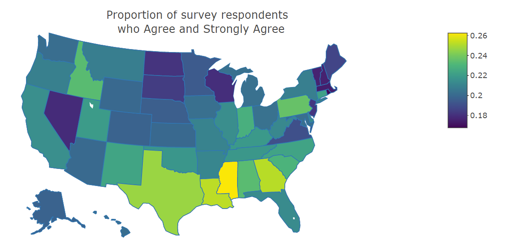
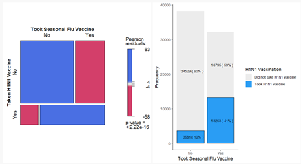
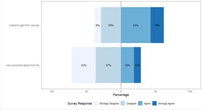
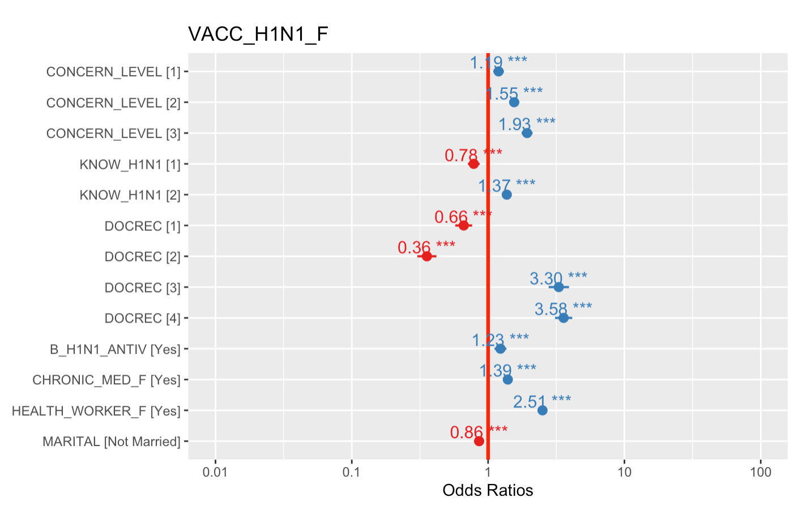
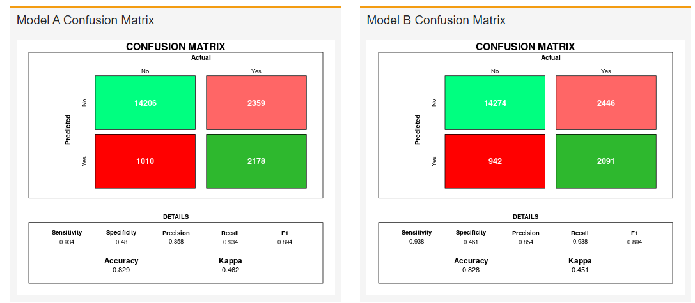
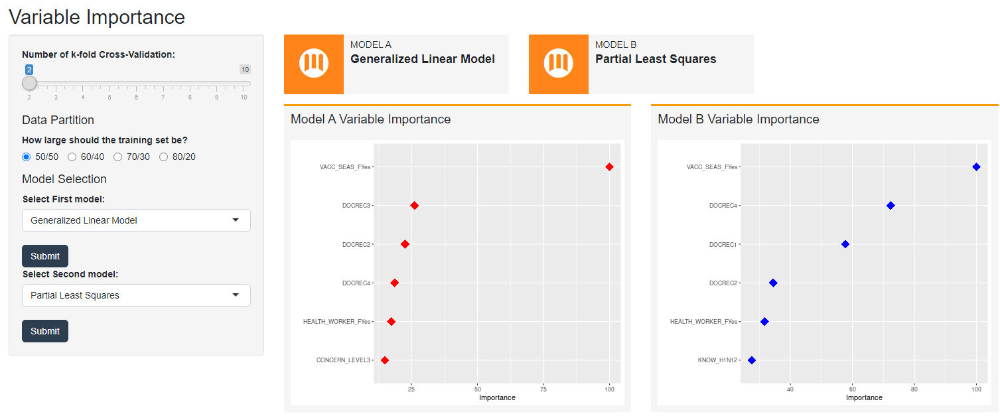

# Introduction

As of April 23, total doses administered for Covid-19 Vaccination has reached 2,213,888 in Singapore [@moh]. At the moment it can only be the elderly and health workers, but we know the next stage is to vaccinate all citizens. Governments in many countries are making COVID-19 vaccine available. At this point, if the vaccine can be delivered efficiently to those who want to be vaccinated, the vaccination rate in Singapore can be increased to maximum in the shortest possible time to prevent the spread of Virus.

Understanding that vaccination is voluntary and that everyone has different attitudes towards vaccines, our group was interested in studying past data to analyze what factors influence whether or not for a people choose to be vaccinated, and how big is the effect. We looked at the H1N1 survey in 2009 in the United States. An extensive study had been conducted by the USA known as the National 2009 H1N1 Flu Survey (NHFS) into the demographics, attitudes towards H1N1 virus or the vaccine, and whether an individual had taken the H1N1 vaccine.

# Motivation and Objectives

Research from France and UK [@thomson] stated that vaccines can save five lives every minute and with an improvement in the global vaccine take-up rate an estimated 1.5millions deaths could be averted each year. The research highlighted that just the communication of the clear benefits of vaccines might not be sufficient to convince people about vaccination, different within different sociodemographic groups need different motivations to get vaccination. Thus, to increase vaccination rates and reduce vaccination hesitancy would entail looking into the factors that result in an individual undergoing vaccination.

Hence, the project was motivated by a desire to firstly understand what the factors influencing an individual to go for vaccination and how assist authorities to improve vaccination rates.
To do so, our interactive Shiny app aspires to achieve the following using the H1N1 survey data as a foundation: 

i) Understand the behavioral and risk factors influencing an individual to undergo vaccination through the visualization of the behavioral or risk traits affects vaccination. Using an explanatory model to identify and visualized those variables that have a scientifically meaningful and statistically significant relationship with vaccination. 

ii) Using the associations between the survey data and the target outcome to generate good predictions for future outcomes through visualization of different modelling outcomes to obtain the best model.

# Review and Comparison

We looked at past works of Singapore Management University (SMU) students for ideas and comparisons.

In a project named *Employee Attrition Analysis and Visualisation*[2020], three different models namely Decision Tree, Random Forest and XGBoosting were used to predict the attrition of employees, using ROC curves to depict the performance of the models. However, we found a lack of customizability for predictive modelling with only three model available, inability to make changes to training/testing datasets and training of the models. The analysis can also benefit from having more comparison methods such as confusion matrix.

In another SMU students’ project called *How Healthy Is Your Neighborhood*[2019]. It was observed from their shiny application that their data exploration was put at the end, which may be in line with their own consideration, because most of their maps and cluster displays are relatively clear and easy to understand. Comparing to our own, many variables in our survey data are abbreviations. For example, B_H1N1_ANTIV stands for Behavior on taking antiviral medication. Hence, it is necessary to include a data dictionary at the early portions of the application. Using some of their ideas as reference, we inserted our data into the tab page 3-explanatory model so that users can directly click through and compare the data.

# Methodology
## Data

We used data from the National 2019 H1N1 Flu Survey (NHFS) provided by the Centre for Disease Control and Prevention (CDC) of the US Department of Health & Human Services. Preparation of the data was conducted in R, of which the main steps were to filter out the rows that had NA values in our target variable and selected columns that did not contain more than 50% of NA values for our analysis. 

## Shiny Architecture

Development of the interactive tool was done on Shiny, an R package used to build interactive web apps. As the group project, we communicate results to the audience via interactive charts, visualizations, text to express what we found insight on the H1N1 survey data, and prediction analysis on each model. Users can click on the selection button and the item on the left to find out what they want to know, and we have also included our datasets and data dictionaries in the Shiny app for easy reference.

The design of the Shiny web app flowed from logical structure and machine learning process:

1. First tab: Agree on Vaccine Distribution and Data Info to form a quick understanding on the distribution with the way of choropleth map. A check box is created to facilitate them to open the variable dictionary.

2. Second tab: Exploratory Data Analysis to form the analysis on the data By adjusting the sidebar on the left, different tables are pop up such as Stacked Bar Chart to analyze each variable.

3. Third tab: Distribution of Survey to use diverging stack bar chart to express the opinion distribution. By adjusting the sidebar on the left, the audience can select the variable to display the chart.

4. Fourth tab: Explanatory Model to form the analysis on building the model to express the deeper inside. There are also two sub tabs, model insight and model visualization. The data set is also inserted to display by the control button.

5. Fifth tab and Sixth tab: Predictive Model and Variable Importance to showcase the model comparison with ROC curve, confusion matrix and highlighted the predictive power of the variables in each model. 

## Analysis Techniques
### Choropleth Map

Choropleth maps are used to visualize geospatial data. For this project, geospatial plots are plotted to visualize the proportion of survey respondents who agree and disagree to ‘I intend to get the H1N1 vaccine’ by state as an introductory insight into the dataset. To do so, we used both **plotly** and **dataset** R package. While there is a wide array of R packages for choropleth maps such as **Choroplethr**, **ggplot 2** and **tmap**, **plotly** has the advantage of allowing users to hover over the map for the proportions in each state, which is a valuable piece of information for users. The state dataset was required to map the state information in our datasets to their abbreviations, longitude, and latitude. 

### Mosaic Plot

Mosaic plots are used to visualize categorical data and can be used to visualize the numbers from a contingency table. For this project, mosaic plots are plotted to visualize the relationship between key behavioural and risk factors with the binary target variable using the **vcd** R package. Behavioural factors such as hand washing and taking antiviral medication reveals the attitudes of the person towards the pandemic, while risk factors such as whether the individual works in health care are chosen as they are expected to have more predictive value on the target variable based on health care research, as compared to demographic factors. The advantage of the **vcd** package over other packages for mosaic plots (such as **ggmosaic** and **dlookr**) is that it can shade the mosaic plot according to the results of the chi-square test, thus helping users to identify which variables have an impact on the target variable at first glance based on the colour of the plot.

### Stacked Bar Chart

Bar charts visualize the distribution of variables and is suitable for categorical variables (as compared to a histogram that is suitable for continuous variables). By using a stacked bar chart, the chart can be used to differentiate values in the dataset along another parameter. Thus, for this project, we plot bar charts to visualize the categorical variables and stack the bars according to whether the individual has taken the vaccine or not for additional insights into our binary target. The R package **ggplot** is chosen over other packages for bar charts like **barplot** and **barplot3d** as ggplot provides the most functionality and is most customizable. It is essential for the package to be highly customizable to display desired graphical features, namely drawing additional attention to the desired target outcome using a border and bright colour as well as displaying the count and frequency of each bar within the bar itself. In this project, the stacked bar chart is used to supplement the mosaic plot to display distribution information that is not as clearly interpretable from them mosaic plot. 

### Diverging Stacked Bar Chart

Diverging stacked bar charts are useful for visualizing the distribution of survey results as it centers upon the neutral response and shows how much each bar extends into the positive or negative sentiment. As this survey includes likert responses, a diverging stacked bar chart is suitable. Aside from packages like **HH**, we used **likert** for its ease of usage, given that it is a package that is primarily used to display likert scale responses. As our survey variables do not have a neutral response, we have centred the diverging stacked bar chart at the midpoint. By selecting various demographics (gender, age, education, income, marital status), users can observe how likert scale responses vary. 

### Bar chart

As bar charts are the best practice visualization technique for comparison of categories, a bar chart is selected to visualize how the probabilities of vaccination vary according to different categories under each variable in the explanatory model. From example, we found that H1N1 vaccination probability is 119% higher for respondents with concern_level1 (not very concerned about H1N1), compared to respondents with concern_level0 (not at all concerned about H1N1). 

The **ggplot2** package in R was used in to create the bar chart used in the app. It is essential for the package to be highly customizable to desired graphical features for the information like geom_text, labs and theme. It allows the user to add more information to illustrate the purpose of the bar char, which we did in the app

### Dot Chart with Error bar

A dot chart is selected to plot the odds ratio in a single plot as it is an appropriate and precise way to present the data visualization. Standard deviation and standard error are the characteristic of the population. When we applied the uncertainty to the dot plot with the population data, the confidence interval within 95% is shown. Thus, for this project, the **sjPlot** package in R was used as it includes a module to plot the odd ratio in the dot chart format. By default, *plot_model()* automatically exponentiates coefficients, which is the odd ratio. 

The argument *show.values = TRUE*  was used to show the value labels with the estimate values, *show.p = FALSE* was used to suppress the asterisks that indicate the significance level of the p-values, *value.offset* was used to adjust the relative positioning of value labels to the dots and lines, and *vline.color = ‘red’* was used to set the vertical line color. 

Using the explanatory model that we have built, the odds ratio was derived and used to supplement the bar chart to provide further insights into the data variables. 

### ROC Curves with AUC

The Receiver Operator Characteristic (ROC) curve is a useful evaluation of binary classification outcomes. It is a probability curve that plots the true positive rate(TPR: y-axis) versus  the false positive rate (FPR: x-axis) that shows the performance of a classification model at all classification thresholds.

The True Positive Rate as known as recall or sensitivity is defined as:
$$
TPR = \frac{TP}{TP+FN}
$$ 

The False Positive Rate or (1- Specificity) is defined as:
$$
FPR = \frac{FP}{FP+TN}
$$ 
The Area Under the Curve (AUC) is the measure of the entire area under the ROC curve. It provides an aggregate measure of model’s performance across all the possible classification thresholds. The AUC ranges from 0 to 1 where an AUC value of 0 means the model’s predictions are 100% wrong and an AUC value of 1 means the predictions are 100% right.The **plotROC** package was used to plot the ROC curves for the models through the usage of ggplot package i.e. ggplot geoms allowing easier customizability of the visualisation.

### Confusion Matrix

The confusion matrix is used to evaluate the performance of a classification model. It is an N x N matrix where N is the number for target classes. The confusion matrix compares the target values with the values that were predicted by the machine learning model. In a binary classification model, the values are represented by True Positive (TP usually the target variable), True Negative(TN), False Positive (FP) and False Negative (FN). The TP and TN value means the predicted value matches the actual value. FN and FP value means the predicted value is wrongly predicted i.e. FP means the actual value is negative but the model predicted a positive value. 
Using these values, *Accuracy, Specificity, Precision, Recall, F1* and *Kappa* of the confusion matrix is calculated to model assessment. 

Accuracy refers to the number of correctly predicted value over the total number of data.
$$
Accuracy = \frac{TP+TN}{TP+FP+TN+FN}
$$ 

Specificity refers to how good the model is at avoiding false alarms.
$$
Specificity= \frac{TN}{FP+TN}
$$ 

Precision refers to how good the model is at assigning positive events to positive class.
$$
Precision= \frac{TP}{TP+FP}
$$ 

Recall refers to how good the model is a detecting the positive class.
$$
Recall= \frac{TP}{TP+FN}
$$ 

F1 score is the harmonic mean of Precision and Recall, i.e. a high F1 means Precision and Recall of Model is high.
$$
F1 Score=2\cdot \frac{Precision*Recall}{Precision + Recall}
$$ 

Kappa is a measure of agreement between observed accuracy with an expected accuracy[@cohencoe]. Kappa helps to provide a more objective description of model performance where there is a large imbalance of class distribution.
$$
\kappa=\frac{p_o-p_c}{1-p_c}
$$

Where the Observed agreement is the proportion of objects where the predicted value matches the trusted label.
$$
p_o=\frac{a+d}{n}
$$

and chance agreement is estimated (for Cohen's kappa) using Bayes' rule
$$
p_c=\bigg(\frac{TP+FP}{n}\bigg)\bigg(\frac{TP+FN}{n}\bigg)+\bigg(\frac{FN+TN}{n}\bigg)\bigg(\frac{FP+TN}{n}\bigg)
$$

The **caret** package was used to calculate the values for the confusion matrix after each model was ran using the test data set to obtain the predicted values. 

### Variable Importance of Models
Variable Importance analysis helps to identify the predictive power of each input variable in a classification model[@varimpt]. It helps to improve the model’s interpretability, and also able to reduce computational cost, optimize data storage and through using a smaller number of relevant input variables to the model without losing the prediction capabilities.

The **vip** package in R was used to derive the variable importance from the machine learning models and plotting out the input variables according to their variable importance.

# Description of Products and Findings

Users can hover over each state for its proportion, which is useful for comparing states that have similar color intensity. Users can also make observations based on the intensity of the color shading on the map given the color legend and observe clusters of states that have similar color intensity in the same region. For example, there is a cluster with lighter colors (representative of a higher proportion) in the south-east region of the map. 

## Stacked Bar Chart and Mosaic Plot

By toggling with the dropdown, users can select each factor to plot it with the target variable on each plot. Both the shading of the mosaic plot and the difference in proportions between the bar charts is an indicator of whether the variable affects the target variable shown in *Figure 1.*. 

For example, the factor with the largest difference between observed values and expected null values is whether the individual has taken the seasonal flu vaccine. It has the largest range of Pearson residuals values from -58 to 63. It also has the largest difference between the proportion of individuals who took the vaccine among those who took the seasonal flu vaccine, and the proportion of individuals who took the vaccine among those who did not take the seasonal flu vaccine. 

## Diverging Stacked Bar Chart

By toggling with each demographic, users can observe how the distribution of survey responses vary as shown in *Figure 2*. Users can also observe the relationship between concern about H1N1 and intent to get the vaccine. For example, among females, the most prevalent survey response to the statement ‘I intend to get H1N1 vaccine.’ is Agree. Comparing both survey questions, while more than 50% strongly disagree and disagree that they are concerned about H1N1, more than 50% would intend to get the vaccine.

## Bar Chart

Users can select each factor to plot it with the target variable on each plot. Using the variable “concern level” and Y-lab as ‘Compare with Not at all concerned about H1N1’. The user is able to compare survey respondents with “Concern_0” to the others of other concern level. The horizontal line segregates the probabilities are higher than one and which are lower than one as shown in *Figure 3.*.

From the chart, the user can gain the following insights:

1. H1N1 vaccination probability is 119% higher in concern_level1(not very concerned about H1N1), compared to concern_level0(Not at all concerned about H1N1). 

2. H1N1 vaccination probability is 155% higher in concern_level2(somewhat concerned about H1N1), compared to concern_level0(Not at all concerned about H1N1). 

3. H1N1 vaccination probability is 193% higher in concern_level3(very concerned about H1N1), compared to concern_level0(Not at all concerned about H1N1).

## Dot Chart with Error bar

The dot chart in *Figure.4* provides an overview of all the variables in the explanatory model and supplements the bar chart which highlights the influence within one variable category.

The different colors assist user to distinguish the type of influence. Positive influences are shown in blue, while negative influences are shown in red. We can see that *DOCREC2* and *DOCREC3* have the lowest and highest odds ratio, with a H1N1 vaccination probability of 35.54% and 330% respectively. *DOCREC2* refers to the doctor’s recommendation for seasonal vaccine and DOCREC3 refers to doctor’s recommendation for H1N1 vaccine.

After the exploratory data analysis (EDA) in the first part, the user has a basic understanding of the data. The user can then learn from the odds ratio in the explanatory model about how the seven variables influence whether the user takes the vaccine. This is the purpose of our explanatory model: to use past data to explain past phenomena.

## ROC Curve

Based on a 2-folding cross-validation, with a 50% split for training and test data, the “Generalized Linear Model” and “Partial Least Squares” methods as models, the ROC curves of the two models are generated. Comparing the ROC curves and the AUC value of the model shown in *Figure 5.*, the Generalized Linear model is the better performing mode with an AUC of 0.841 compared to 0.822 of the Partial Least Square model. 

## Confusion Matrix

The model performance can be further assessed and confirmed through the confusion matrix results as shown in *Figure 6*. The Generalized Linear Model (Model A) has performed slightly better with an accuracy of 0.829, precision of 0.858 compared the Partial Least Square model’s accuracy of 0.828 and precision of 0.854.

## Variable Importance

Looking at variable importance results in *Figure.7*, the user will be able to understand that the variables *VACC_SEAS_F* i.e. whether the person has taken the seasonal vaccine, *DOCREC* i.e. whether their doctor has recommended to take the vaccine and *HEALTH_WORKERF* i.e. whether the survey respondent worked in healthcare field,  are variables that contributed the predictive capabilities of both machine learning models. With these insights, the user will be able to better interpret the model and understand which are the variables that will influence the model. 

# Conclusion and Further Ideas

This paper set out to predict whether an individual is likely to undergo the H1N1 vaccination based on the National 2009 H1N1 Flu Survey in the United States. This was motivated by the importance of vaccination as a public health measure to combat pandemics considering recent pandemics and explores the attitudes behind why an individual takes or does not take the vaccine.

The application was developed using Shiny on R and draws on a range of R packages to build various models and visualizations to help users draw insights from the data. Insights progress from exploratory, to explanatory and finally predictive to give users a sequential deepening of insights from the dataset. 
We suggest that further development of the app address the following ideas:

i) Hosting the application on Shiny.io under a subscription scheme that offers additional memory space: While Shiny.io offers a free subscription to all users, memory space for the Shiny app is limited to 1GB, presenting memory space constraints for our Shiny application, especially with respect to predictive modelling. As we are running multiple predictive models iteratively, a lot of memory space needs to be available for the models to be run smoothly. Our team had to work around the space constraints of Shiny.io to shape our application.

ii) Additional user interaction features within the app: It would be interesting to observe how the outcome of whether an individual would take the H1N1 vaccination depending on how the variables in each predictive model are modified. However, we did not include this feature in our application as the focus of the application was on visualization, and such a toggling function would not involve any data visualization. In a future project where the focus is more on statistical analysis, this direction could be explored. 

iii) The application could be enhanced to allow the uploading of similar survey data to make use of EDA and modeling capabilities already present. 

# Acknowledgements

The authors thank Associate Professor, KAM Tin Seong, Singapore Management University for his support and guidance.

# References

---
references:
- id: cohencoe
  title: A Coefficient of Agreement for Nominal Scales
  author:
  - family: Cohen
    given: Ismael
  container-title: Educational and Psychological Measurement
  volume: 11
  URL: 'https://doi.org/10.1177/001316446002000104'
  DOI: 10.1177/001316446002000104
  issue: 20
  publisher: Nature Publishing Group
  page: 261-263
  type: article-journal
  issued:
    year: 1960
- id: varimpt
  title: Variable Importance Analysis in Imbalanced Datasets
  author:
  - family: Ahrazem Dfuf
    given: Ismael
  container-title: IEEE Access
  volume: 11
  URL: 'https://doi.org/10.1109/ACCESS.2020.3008416'
  DOI: 10.1109/ACCESS.2020.3008416
  issue: 20
  publisher: IEEE Access
  page: 127404--127430
  type: article-journal
  issued:
    year: 2020
- id: thomson
  title: Strategies to increase vaccine acceptance and uptake
  author:
  - family: Thomson
    given: Augus
  - family: Vallee-Tourangeau
    given: Gaelle
  - family: Suggs
    given: L,Suzanne
  container-title: Vaccine
  volume: 11
  URL: 'https://www.sciencedirect.com/science/article/pii/S0264410X1831140X'
  DOI: 10.1016/j.vaccine.2018.08.031
  issue: 36
  publisher: Vaccine
  page: 6457--6458
  type: article-journal
  issued:
    year: 2018
- id: carrieri
  title: Predicting vaccine hesitancy from area-level indicators
  author:
  - family: Carrieri
    given: Vincenzo
  - family: Lagravinese
    given: Raffele
  - family: Resce
    given: Giuliano
  container-title: medRxiv
  URL: 'https://www.medrxiv.org/content/early/2021/03/09/2021.03.08.21253109'
  DOI: 10.1101/2021.03.08.21253109
  publisher: Cold Spring Harbor Laboratory Press
  type: article-journal
  issued:
    year: 2021
- id: moh
  title: COVID-19 Vaccination, Ministry of Health, Singapore
  URL: 'https://www.moh.gov.sg/covid-19/vaccination'
  publisher: Ministry of Health, Singapore
  type: article-journal
  issued:
    year: 2021
...
