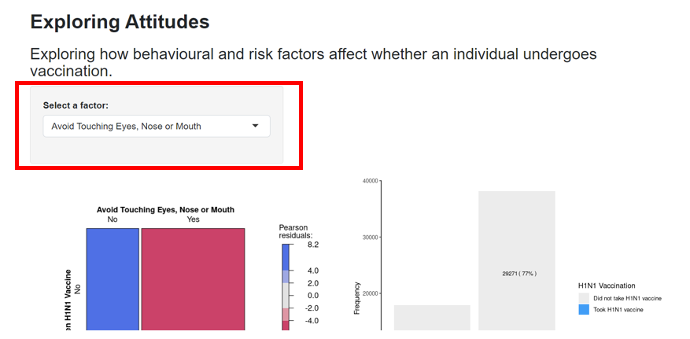
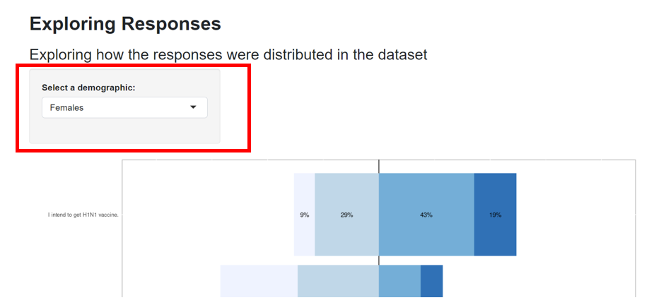

```{r setup, include=FALSE}
knitr::opts_chunk$set(echo = FALSE)
```

# User Guide – Vaccination Survey Analysis and Prediction with Shiny

## 1. Strongly Agree and Agree That They Intend to Take The H1N1 Vaccine
This tab show you the Choropleth map to show the distribution in US

And if you click the botton show the defination on variables

```{r, out.width='100%', fig.align='left'}
knitr::include_graphics('picture/map.PNG')
```

It will pop up our variable dictionary

```{r, out.width='100%', fig.align='left'}
knitr::include_graphics('picture/variable_dictionary.PNG')
```

## 2. Agree on Vaccine Distribution and Data Info
Use this tab to do exploratory data analysis. 

```{r, out.width='100%', fig.align='left'}

```

* Users select the factor of interest 
* Observe how the graphs are plotted:

  + Mosaic plot: the intensity of color shading, range of Pearson residuals 
  + Bar chart: count and proportions of values  

## 3.Distribution of Survey  

```{r, out.width='100%', fig.align='left'}

```

- Select a demographic of interest  

- Observe how the proportions on the graph change 

## 4. Explanatory Model
Form the analysis on building the model.There are also two sub tabs, Model Insight and Model Visualization. The data set is also inserted to display by the control button 

```{r, out.width='30%', fig.align='left'}
knitr::include_graphics('picture/EM_0.PNG')
```

## 4.1 Model Insight

Click Side bar above to select the variable you want to view

```{r, out.width='100%', fig.align='left'}
knitr::include_graphics('picture/EM_1.PNG')
```

Then the coordinate bar chart will show like 

```{r, out.width='70%', fig.align='left'}
knitr::include_graphics('picture/EM_2.PNG')
``` 

And the left side, variable explanation will also change.

```{r, out.width='70%', fig.align='left'}
knitr::include_graphics('picture/EM_3.PNG')
``` 

## 4.2 Model Visualization

First is to choose the panel that you want to see

```{r, out.width='70%', fig.align='left'}
knitr::include_graphics('picture/EM_5.PNG')
``` 

Then in the first panel, we have odd ratio plot and chiq plot.

Also, if you want to see the data set that we use to build the model, you can click the Show data table button.

{width=40%} {width=50%}


Then in the second panel, we have side bar to visual more graphs, you can choose diagnose ill fitting plot or KS Chart observation. And we add the defination of each graph in the middle.


```{r, out.width='100%', fig.align='left'}
knitr::include_graphics('picture/EM_6.PNG')
``` 

## 5. Predictive Model 

1. The user can choose the data partition for the training and test data. The options available are : 

- 50% training /50% test, 

- 60% training /40% test 

- 70% training /30% test 

- 80% training /20% test 

```{r, out.width='100%', fig.align='left'}
knitr::include_graphics('picture/User Guide Prediction Tab.PNG')
``` 


2.Next, the user  can select the number of k. The parameter called k that refers to the number of groups that a given data sample is to be split into.  Of the k subsamples, a single subsample is retained as the validation data for testing the model, and the remaining k − 1 subsamples are used as training data. The cross-validation process is then repeated k times, with each of the k subsamples used exactly once as the validation data. 

3. The user will choose the first machine learning model to be used. The user can scroll through the list or type in the key words in the list.

```{r, out.width='70%', fig.align='left'}
knitr::include_graphics('picture/User Guide Prediction Tab II.PNG')
``` 

4. Once the first model is chosen, the user can click on update to plot the ROC curve for the model. 

```{r, out.width='30%', fig.align='left'}
knitr::include_graphics('picture/User Guide Prediction Tab III.PNG')
``` 

5. Next, the user can click on the “Confusion Matrix” button to plot the confusion matrix for the first model. 

```{r, out.width='70%', fig.align='left'}
knitr::include_graphics('picture/User Guide Prediction Tab IV.PNG')
``` 

6. Repeat step 4 and 5 for the second machine learning model. 

## 6. Variable Important Tab

1. Similar to the prediction tab, the user can choose the data partition for the training and test data. The options available are :  

50% training /50% test, 

60% training /40% test 

70% training /30% test 

80% training /20% test 

2. Next, the user  can select the number of k.  

The parameter called k that refers to the number of groups that a given data sample is to be split into.  Of the k subsamples, a single subsample is retained as the validation data for testing the model, and the remaining k − 1 subsamples are used as training data. The cross-validation process is then repeated k times, with each of the k subsamples used exactly once as the validation data. 

3. The user will choose the first machine learning model to be used. The user can scroll through the list or type in the key words in the list.  

4. Once the first model is chosen, the user can click on “Submit” to plot the Variable Importance chart for the model.

```{r, out.width='70%', fig.align='left'}
knitr::include_graphics('picture/User Guide Prediction Tab V.PNG')
``` 

5. Repeat the step 3 and 4 for the second machine learning model.  

